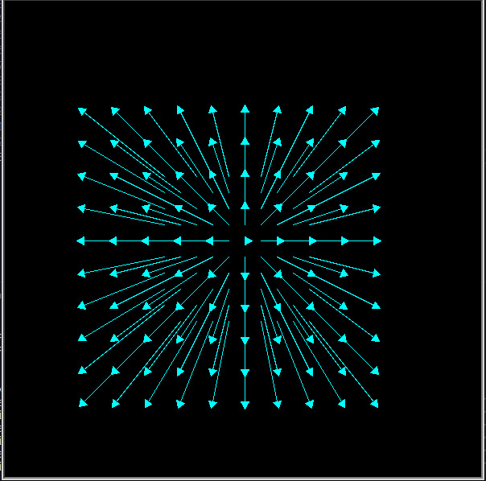
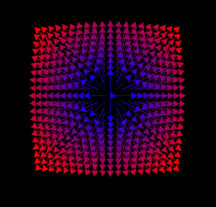
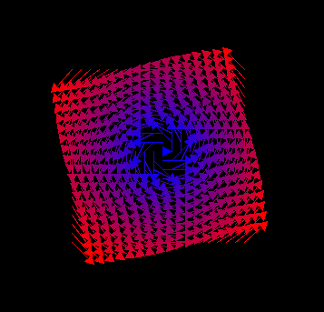
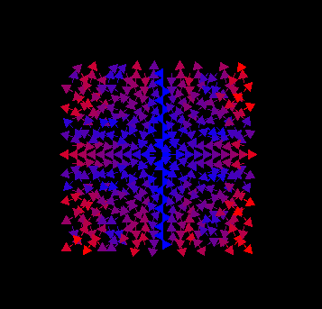

# Simulador de Espaço Vetorial

# O que é um Espaço Vetorial?

Em matemática um campo vetorial ou campo de vetores é uma construção em cálculo vetorial que associa um vetor a todo o ponto de uma variedade diferenciável (como um subconjunto do espaço euclidiano, por exemplo). Isto é, um campo de vetores é uma função vetorial que associa um vetor a cada ponto P(x,y,z) do espaço xyz, genericamente dada por:

**F**(x, y, z) = f(x,y,z)**i** + g(x,y,z)**j** + h(x,y,z)**k**

Onde f(x,y,z), g(x,y,z) e h(x,y,z) são as funções componentes que, quando associadas a um ponto P(x,y,z), fornecem o valor de cada componente do vetor na direção de i (vetor unitário na direção e sentido do eixo X positivo), j (vetor unitário na direção e sentido do eixo Y positivo) e k (vetor unitário na direção e sentido do eixo Z positivo), respectivamente.

Campos vetoriais são geralmente utilizados na física para indicar, por exemplo, a velocidade e a direção de um fluido ou corpo a mover-se pelo espaço, ou o comprimento e direção de alguma força, tal como a força magnética ou gravitacional, com seus valores de ponto em ponto. 

# Como utilizar?

> Todos esses resultados são frutos dos exemplos da pasta exemplos.

Gerando o campo vetorial para a **F1**(x, y) = x**i** + y**j**

Defina o campo
```python

def f(p: Point) -> 'Vector':
    return Vector(p.x, p.y)
```

Crie o objeto `Field` e utilize o método `prepare()`
```python
F = Field(f, 100, 100, 10)

F.prepare()
```

Desenhe o campo vetorial
`F.draw()`

Resultado


Caso você deseje ver o campo _normalizado_. Modifique:

```python

def f(p: Point) -> 'Vector':
    return Vector(p.x, p.y)

F = Field(f, 100, 100, 10)

F.prepare()

F.normalize()

F.draw()

```

Resultado


# Alguns resultados

**F2**(x, y) = -y**i** + x**j** 



**F3**(x, y) = xcos(y)**i** + ysin(x)**j** 

